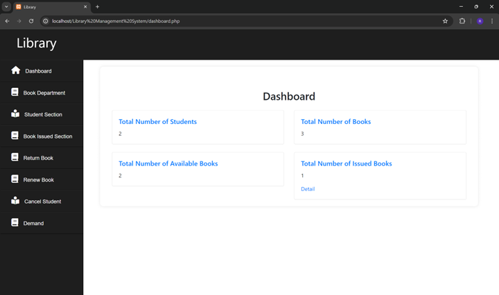
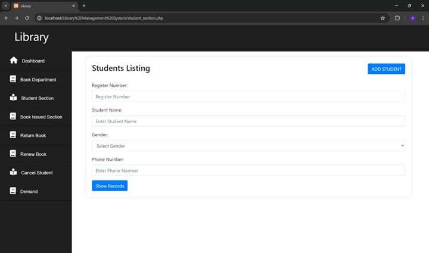

# Library Management System

A web-based project developed as part of the **Introduction to Web Development** (Course Code: 4340704) course in the Diploma Engineering program at Gujarat Technological University (GTU).

## 📋 Project Overview

This project demonstrates a comprehensive library management system designed to streamline operations for both librarians and students. It covers student registration, book management, book issuing/returning, demand tracking, and fine management — all through a clean, web-based interface.

## 📸 Screenshots

### Dashboard


### Student Section


## 🛠️ Technologies Used

| Technology | Purpose |
|---|---|
| 🌐 HTML | Frontend Structure |
| 🎨 CSS | Styling & Layout |
| 🅱️ Bootstrap | Responsive UI Components |
| 🐘 PHP | Backend Programming |
| 🗃️ JDBC | Database Connectivity |
| 🐬 MySQL | Database Management |
| 🚀 Apache | Web Server |

## 📁 Project Structure

```
LibraryManagementSystem/
├── dashboard.php               # Admin dashboard with stats
├── dashboard_totalstudents.php # Total students view
├── dashboard_totalbooks.php    # Total books view
├── dashboard_totalavailablebooks.php
├── dashboard_totalissuedbooks.php
├── dashboard_issuedbooktostudent.php
├── student_section.php         # Student listing & search
├── add_student.php             # Add new student form
├── book_department.php         # Book catalog & search
├── add_book.php                # Add new book form
├── book_issued.php             # Issue book to student
├── book_renew.php              # Renew issued book
├── book_return.php             # Return a book
├── student_demand.php          # Student book demand
├── see_demand.php              # View student demands
├── first.php                   # Session check
├── db.php                      # Database connection
├── screenshots/
│   ├── Dashboard.png
│   ├── StudentSection.png
│   ├── BookDepartment.png
│   └── BookIssued.png
└── README.md
```

## ⚙️ Modules

- **Dashboard** – Displays total students, total books, available books, and issued books at a glance
- **Add New Student** – Registers students with name, registration number, gender, contact info, and more
- **Cancel Student Membership** – Removes a student from the active membership list
- **Access Student Records** – Retrieves complete student information including borrowed books and fines
- **Add New Book** – Adds books to the catalog with title, author, ISBN, publisher, and other details
- **Search Book** – Searches the catalog by title, author, or keyword with full availability details
- **Issue Book to Student** – Issues available books to students with automatic 7-day due date calculation
- **Renew Book** – Extends the due date for eligible borrowed books
- **Return Book** – Marks a book as returned and updates catalog availability
- **Add Student Demand** – Records student requests for unavailable books
- **See Student Demands** – Displays all book demands made by students

## 🗄️ Database Setup

> **Database Name:** `library`  
> **Server:** MariaDB 10.4+ | **PHP Version:** 8.2+

Import the provided `library.sql` file directly via phpMyAdmin, or run the following SQL manually:

```sql
CREATE DATABASE library;

USE library;

-- Students table
CREATE TABLE `students` (
  `id` INT(11) NOT NULL AUTO_INCREMENT PRIMARY KEY,
  `s_name` VARCHAR(255) DEFAULT NULL,
  `sfather_name` VARCHAR(255) DEFAULT NULL,
  `s_surname` VARCHAR(255) DEFAULT NULL,
  `s_address` TEXT DEFAULT NULL,
  `gender` ENUM('male','female') DEFAULT NULL,
  `s_email` VARCHAR(255) DEFAULT NULL,
  `s_phoneno` INT(10) NOT NULL,
  `s_birth_date` DATE DEFAULT NULL,
  `s_photo` VARCHAR(255) DEFAULT NULL,
  `created_at` TIMESTAMP NOT NULL DEFAULT CURRENT_TIMESTAMP(),
  `updated_at` TIMESTAMP NOT NULL DEFAULT CURRENT_TIMESTAMP() ON UPDATE CURRENT_TIMESTAMP()
);

-- Books table
CREATE TABLE `books` (
  `id` INT(11) NOT NULL AUTO_INCREMENT PRIMARY KEY,
  `date_of_entry` DATE DEFAULT NULL,
  `book_title` VARCHAR(255) DEFAULT NULL,
  `language` VARCHAR(255) DEFAULT NULL,
  `author` VARCHAR(255) DEFAULT NULL,
  `publisher` VARCHAR(255) DEFAULT NULL,
  `year` DATE DEFAULT NULL,
  `pages` BIGINT(20) DEFAULT NULL,
  `location` VARCHAR(255) DEFAULT NULL,
  `price` VARCHAR(255) DEFAULT NULL,
  `isbn_no` VARCHAR(255) DEFAULT NULL,
  `status` VARCHAR(255) DEFAULT NULL,  -- '1' = available, '0' = issued
  `keyword` VARCHAR(255) DEFAULT NULL,
  `created_at` TIMESTAMP NOT NULL DEFAULT CURRENT_TIMESTAMP(),
  `updated_at` TIMESTAMP NOT NULL DEFAULT CURRENT_TIMESTAMP() ON UPDATE CURRENT_TIMESTAMP()
);

-- Book issued records table
CREATE TABLE `book_issueds` (
  `id` INT(11) NOT NULL AUTO_INCREMENT PRIMARY KEY,
  `student_id` INT(11) DEFAULT NULL,
  `book_id` INT(11) DEFAULT NULL,
  `book_name` VARCHAR(255) DEFAULT NULL,
  `issued_date` DATE DEFAULT NULL,
  `due_date` DATE DEFAULT NULL,
  `return_date` DATE DEFAULT NULL,
  `created_at` TIMESTAMP NOT NULL DEFAULT CURRENT_TIMESTAMP(),
  `updated_at` TIMESTAMP NOT NULL DEFAULT CURRENT_TIMESTAMP() ON UPDATE CURRENT_TIMESTAMP(),
  FOREIGN KEY (`student_id`) REFERENCES `students`(`id`) ON DELETE CASCADE ON UPDATE CASCADE,
  FOREIGN KEY (`book_id`) REFERENCES `books`(`id`) ON DELETE CASCADE ON UPDATE CASCADE
);

-- Book demand table
CREATE TABLE `book_demand` (
  `demand_id` INT(11) NOT NULL AUTO_INCREMENT PRIMARY KEY,
  `student_id` INT(11) DEFAULT NULL,
  `book_title` VARCHAR(255) NOT NULL,
  `author` VARCHAR(255) NOT NULL,
  `publisher` VARCHAR(255) NOT NULL,
  `demand_date` TIMESTAMP NOT NULL DEFAULT CURRENT_TIMESTAMP(),
  FOREIGN KEY (`student_id`) REFERENCES `students`(`id`)
);
```

## 🚀 How to Run

1. Clone this repository
2. Move the project folder to your server's root directory (e.g., `htdocs` for XAMPP)
3. Set up the MySQL database using the SQL above
4. Update the database credentials in `db.php` if needed
5. Start Apache and MySQL from XAMPP / WAMP Control Panel
6. Open `http://localhost/LibraryManagementSystem/dashboard.php`

## 📅 Submitted

**Branch:** Diploma in Computer Engineering  
**Semester:** 4th  
**Subject:** Introduction to Web Development (4340704)  
**Submitted to:** Gujarat Technological University (GTU)
